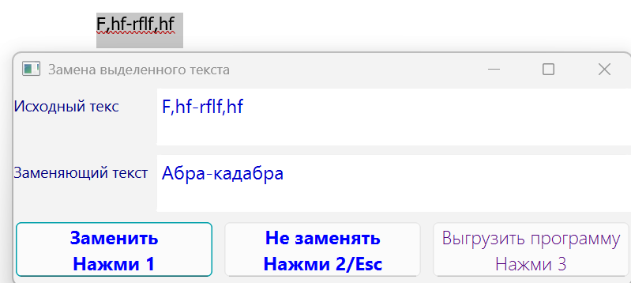
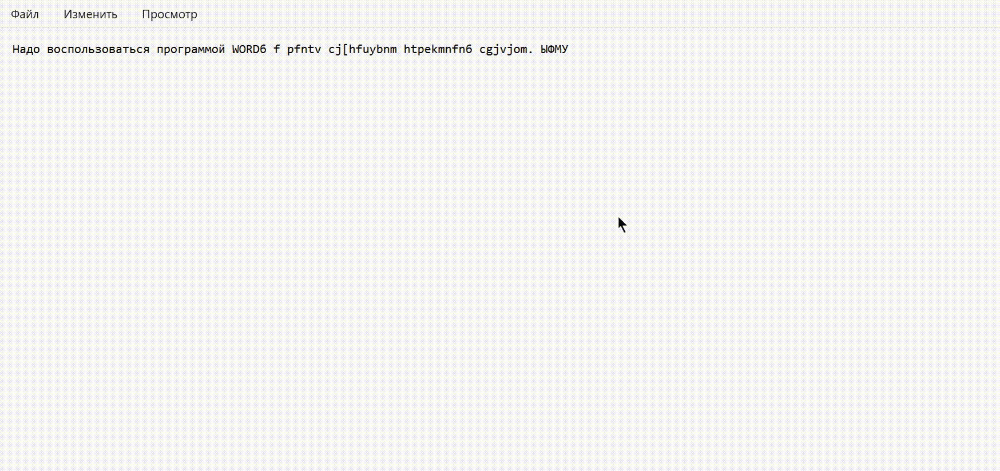

# Keyboard2

[English](README_EN.md)

**Keyboard2** - Windows-утилита для переключения раскладки одной клавишей и исправления текста, набранного не в той раскладке.

Я сделал эту программу, чтобы убрать несколько раздражающих сценариев при ежедневной работе с клавиатурой:

- при переключении раскладки через `Alt+Shift` иногда срабатывают побочные действия активной программы;
- при регулярном вводе текста на русском и английском легко забыть переключить раскладку и набрать фразу не теми символами, а затем не во всех программах возможно исправить уже набранный текст без повторного ввода;
- часто приходится вводить одни и те же данные: e-mail, телефон, подпись или короткие текстовые заготовки.

## Скриншот



## Демонстрация



## Что умеет программа

- Переключает раскладку клавиатуры одной клавишей: `Caps Lock`.
- Исправляет выделенный текст, набранный в неверной раскладке: `Scroll Lock`.
- Показывает диалог с исходным и исправленным текстом перед заменой.
- Поддерживает быстрый режим `--fast`, при котором замена выполняется без диалога подтверждения.
- Вставляет заранее заданные пользовательские данные по глобальным горячим клавишам.
- Работает из системного трея.
- Запускает выбранную внешнюю программу, например собственный калькулятор.
- Не позволяет запустить второй экземпляр приложения.
- Ведет логирование и может быть собрана в standalone `.exe` через PyInstaller.

## Основные горячие клавиши

- `Caps Lock` - переключить раскладку клавиатуры.
- `Scroll Lock` - исправить выделенный текст, набранный в другой раскладке.
- `Ctrl+F3` - вставить e-mail из настроек.
- `Ctrl+F4` - вставить телефон из настроек.
- `Ctrl+F5` - запустить выбранную внешнюю программу, например собственный калькулятор.
- `Ctrl+F9` - вставить подпись из настроек.

## Пример сценария

Пользователь хотел набрать:

```text
привет
```

Но текст был введен в английской раскладке:

```text
ghbdsn
```

Достаточно выделить ошибочный текст и нажать `Scroll Lock`. Keyboard2 получит выделение через буфер обмена, преобразует символы по соответствию клавиш русской и английской раскладки и предложит заменить текст.

В режиме `--fast` окно подтверждения не появляется: выделенный текст заменяется сразу.

## Настройки

Программа читает пользовательские значения из `.env` через `python-dotenv`.

Пример `.env`:

```env
EMAIL=user@example.com
TELEPHONE="+7 000 000-00-00"
SIGNATURE="С уважением,\nИмя Фамилия"
CALCULATOR=C:\Windows\System32\calc.exe
CONSOLE_LOG_LEVEL=INFO
FILE_LOG_LEVEL_INFO=DEBUG
FILE_LOG_PATH=C:\Temp\keyboard2.log
```

Настоящий `.env` не должен попадать в репозиторий. Для публичного примера в проекте есть файл `.env.example`.

## Запуск из исходного кода

Проект рассчитан на Windows. Для обычного запуска используются runtime-зависимости из `requirements.txt`.

```powershell
python -m venv .venv
.\.venv\Scripts\activate
pip install -r requirements.txt
python .\src\keyboard2.py
```

Запуск в быстром режиме:

```powershell
python .\src\keyboard2.py --fast
```

## Сборка EXE

Инструменты разработки и сборки вынесены в `requirements-dev.txt`. В проекте есть файл `keyboard2.spec` для сборки через PyInstaller.

```powershell
pip install -r requirements-dev.txt
pyinstaller keyboard2.spec
```

После сборки исполняемый файл будет создан в каталоге `dist`.

## Проверки

Для запуска тестов и проверок установите dev-зависимости:

```powershell
pip install -r requirements-dev.txt
```

Запуск тестов:

```powershell
pytest
```

Проверка форматирования и типов:

```powershell
black --check src tests
mypy
```

## Архитектура

Проект разделен на несколько модулей:

- `src/keyboard2.py` - точка входа приложения, настройка логирования и верхнеуровневая обработка ошибок.
- `src/app.py` - жизненный цикл PyQt6-приложения, системный трей, регистрация горячих клавиш, single-instance guard.
- `src/main_window.py` - диалог исправления текста и пользовательское взаимодействие.
- `src/controller.py` - связующий слой между UI и обработчиками горячих клавиш.
- `src/hotkeys_handlers.py` - действия, выполняемые по горячим клавишам.
- `src/replacetext.py` - преобразование текста между русской и английской раскладками.
- `src/windows_hotkeys.py` - регистрация глобальных горячих клавиш через WinAPI.
- `src/ll_keyboard.py` - низкоуровневый keyboard hook для специальных клавиш.
- `src/send_input_keys.py` - ввод клавиш и текста через WinAPI `SendInput`.
- `src/win_clipboard.py` - работа с буфером обмена Windows.
- `src/single_instance.py` - защита от повторного запуска приложения.
- `src/tune_logger.py` - настройка логирования.

## Технические детали

В проекте используются:

- Python;
- PyQt6;
- WinAPI;
- глобальные горячие клавиши;
- low-level keyboard hook;
- clipboard integration;
- `SendInput` для программного ввода;
- `python-dotenv` для настроек;
- `logging` с файловым логом;
- PyInstaller для сборки `.exe`.

## Ограничения

- Программа предназначена только для Windows.
- Для части функций могут потребоваться права администратора.
- Глобальные горячие клавиши зависят от окружения Windows и уже занятых сочетаний клавиш.
- Работа с выделенным текстом зависит от поведения активного приложения.
